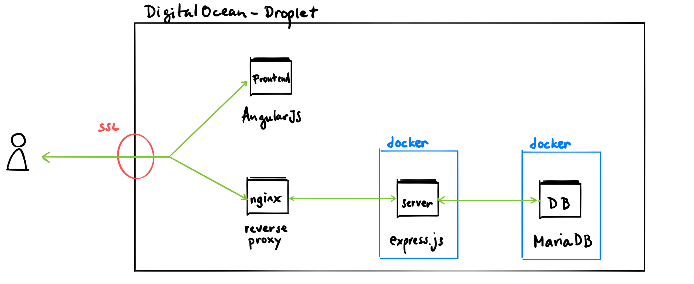
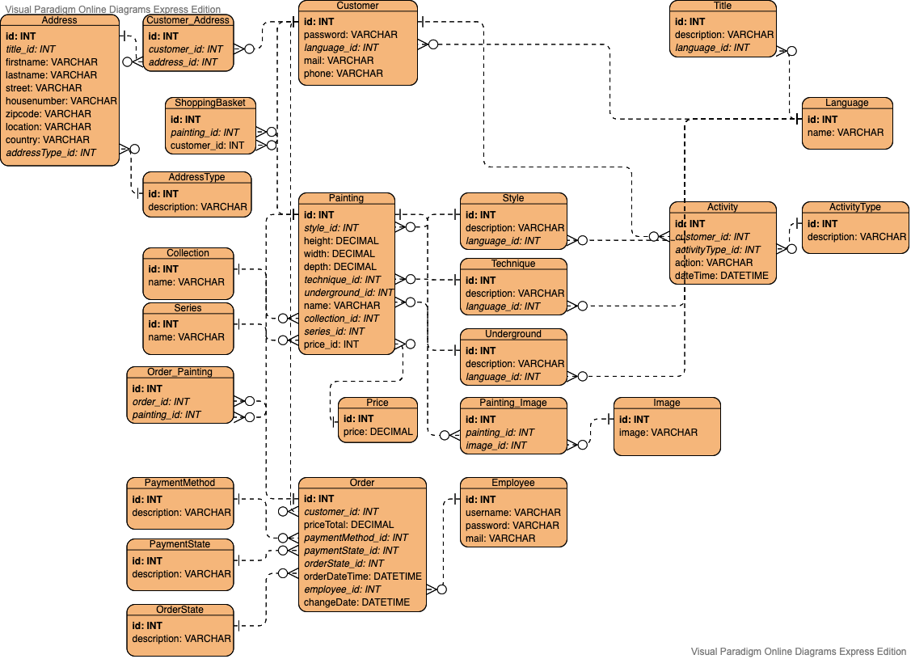

# ichbinich
Digital Ideation - Mentoring Project

Goal of this project was to create a website, which displays paintings in an astethic way and offers the functionality to directly sell them. 
The website contains a CMS for dynamically maintaining the content.

## Scheduling
https://docs.google.com/spreadsheets/d/1VxBda2RsCYcu5nPVJz7ooNNhFUHOWbch1ScIpDf1E5A/edit#gid=0

## Infrastructure
I'm hosting my applications on a DigitalOcean droplet accessible with SSL on port 443. Signature made by "Let's encrypt". Front end is an AngularJS application because I wanted try out another front end framework than VueJS. In the back end I will stick with an express.js server behind a nginx reverse proxy for security reasons. As a database I use MariaDB. The reason I use MariaDB is explained below in the database section. Express server and the database are running in docker containers for improved maintainability.

### Infrastructure - Diagram

## Database
I chose to use MariaDB (a relational open-source database) because I want to have structured consistent data in the back end of my shop. Additionaly it's user-friendlier to inspect data in a relational database while the project is still in developement. I didn't chose MySQL or ORACLE because I already worked with both in the past but never with MariaDB.  

### ER - Diagram

## Use cases
In order to ensure a working project by the end of the module I started with defining the use cases for a MVP (minimum viable product).

1. Show a list of paintings with all their information.
2. User is able to add paintings to the shopping basket (Cookie).
3. User is able to place an order, fill out the needed information and pay.
4. User gets a confirmation mail.
5. Employees get an order mail.

Since the database model is designed to be capable of much more, following features will be added after the MVP is implemented and working.

6. Employees are able to sign in.
7. Employees can add paintings.
8. Employees can see open orders.
9. Employees can change the order state.
10. Users get a mail notification on an order change.
11. Users can register.
12. Users can sign in.
13. Users can reset password.
14. Users can see their orders.
15. Users can modify their personal data.

The database is able to handle multiple languagues which will not be implemented in the front end during this module.
